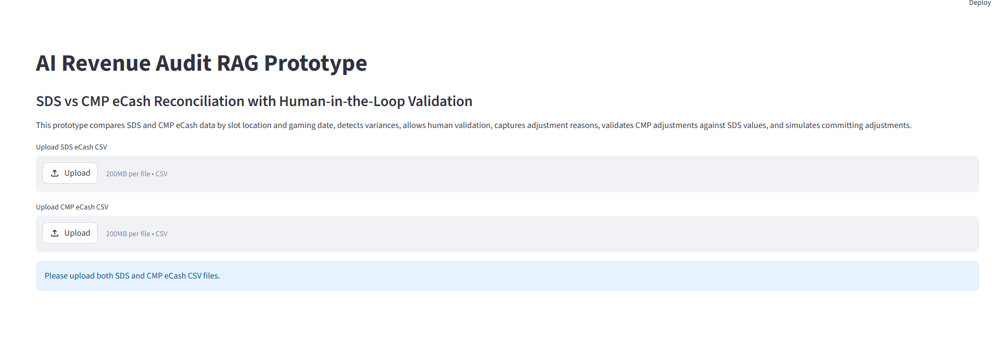
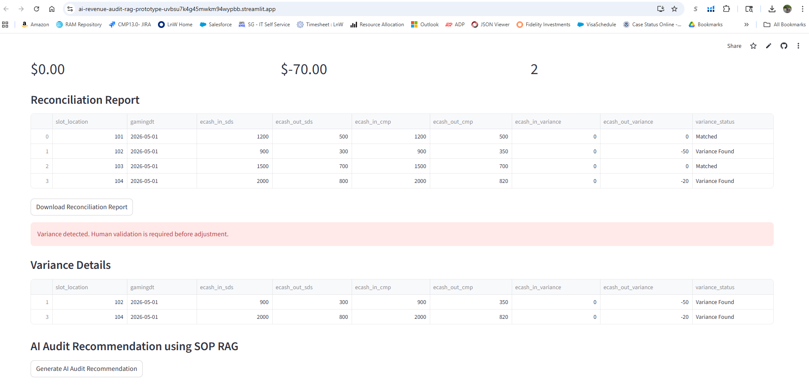
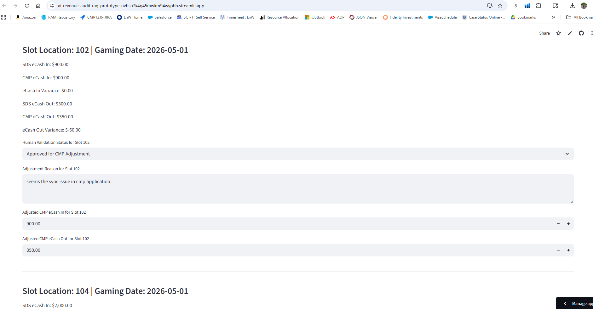

# AI Revenue Audit RAG Prototype

## Overview

This project demonstrates an AI-assisted eCash reconciliation workflow for casino revenue audit operations.

The prototype compares SDS Slot System eCash data against CMP eCash data by slot location and gaming date, identifies variances, enables human-in-the-loop validation, captures adjustment reasons, validates adjustments against SDS values, retrieves SOP guidance, generates AI audit recommendations using OpenAI, and reruns reconciliation after approved adjustments are committed.

The solution simulates a real-world casino revenue audit process using Python, Pandas, Streamlit, OpenAI, and Retrieval-Augmented Generation (RAG).

---

## Author

Gowrishankar Badanal Sivalingappa  
LinkedIn: https://www.linkedin.com/in/gowrishankarbs  
GitHub: https://github.com/gowrishbs84

AI TPM | Revenue Systems | AI Automation | Gaming Operations

## Live Demo

[Streamlit Live Application](https://ai-revenue-audit-rag-prototype-uvbsu7k4g45mwkm94wypbb.streamlit.app/)

## Business Problem

Casino revenue audit teams spend significant operational effort reconciling transactional data across multiple systems.

Traditional reconciliation processes are:
- highly manual
- spreadsheet driven
- time-consuming
- prone to human error

Revenue auditors must:
- compare SDS and CMP values
- identify variances
- investigate discrepancies
- validate adjustments
- apply corrections
- rerun reconciliation reports

This prototype demonstrates how AI-assisted workflows, deterministic reconciliation tools, SOP-grounded RAG, and human-in-the-loop validation can modernize the reconciliation process.

---

## Key Features

- SDS vs CMP eCash reconciliation
- Slot-level variance detection
- Deterministic reconciliation tool
- SOP-grounded RAG workflow
- OpenAI-powered audit recommendations
- Human-in-the-loop validation
- Adjustment reason capture
- CMP adjustment simulation
- Validation against SDS values
- Reconciliation rerun process
- Downloadable reconciliation reports
- Downloadable adjustment audit logs
- AI-generated audit recommendations

---

## AI Architecture Pattern

This prototype demonstrates an enterprise AI architecture pattern combining:

- Deterministic reconciliation tools
- Retrieval-Augmented Generation (RAG)
- SOP-grounded AI recommendations
- Human-in-the-loop approval workflow

### Architecture Flow

Upload SDS + CMP Files
        ↓
Python Reconciliation Tool
        ↓
Variance Detection
        ↓
SOP Retrieval
        ↓
OpenAI Audit Recommendation
        ↓
Human Validation
        ↓
Adjustment Approval
        ↓
Reconciliation Rerun

### AI Design Principles

- Financial calculations are performed only by deterministic reconciliation tools.
- The LLM does not independently calculate revenue totals.
- The LLM uses reconciliation output and SOP guidance to generate audit recommendations.
- Human approval is required before adjustments are committed.

---

## Workflow

Upload SDS eCash File
        ↓
Upload CMP eCash File
        ↓
System compares data by:
- slot_location
- gamingdt
        ↓
Variance detection
        ↓
Reconciliation report generation
        ↓
SOP retrieval
        ↓
OpenAI audit recommendation
        ↓
Human validation review
        ↓
Adjustment reason entry
        ↓
CMP adjustment simulation
        ↓
Validation against SDS values
        ↓
Commit approved adjustments
        ↓
Rerun reconciliation

---

## Application Screenshots

### File Upload Screen

### Variance Detection Screen

### Human-in-the-Loop Adjustment Screen

---

## Sample Data Format

### SDS eCash File

csv
slot_location,gamingdt,ecash_in,ecash_out
101,2026-05-01,1200,500
102,2026-05-01,900,300
103,2026-05-01,1500,700
104,2026-05-01,2000,800

### CMP eCash File

csv
slot_location,gamingdt,ecash_in,ecash_out
101,2026-05-01,1200,500
102,2026-05-01,900,250
103,2026-05-01,1500,700
104,2026-05-01,1950,780

---

## Technologies Used

- Python
- Streamlit
- Pandas
- OpenAI API
- python-dotenv

---

## Knowledge Base / SOP RAG

The project uses a local knowledge base file:

knowledge_base/ecash_audit_sop.txt

The SOP guidance is retrieved and passed into the OpenAI prompt to ground the audit recommendation.

This demonstrates a Retrieval-Augmented Generation (RAG) pattern where:
- reconciliation calculations are performed by deterministic tools
- SOP documents provide grounding context
- OpenAI generates audit recommendations based on retrieved guidance

---

## How to Run the Application

### Install Dependencies

py -m pip install -r requirements.txt

### Configure Environment Variable

Create a `.env` file:

OPENAI_API_KEY=your_api_key_here

### Run Streamlit Application

py -m streamlit run app.py

---

## Human-in-the-Loop Validation

This prototype demonstrates enterprise-style audit controls where:

- variances are identified automatically
- reconciliation is performed by deterministic tools
- SOP guidance is retrieved using RAG
- AI generates audit recommendations
- human auditors validate discrepancies
- adjustment reasons are captured
- CMP adjustments are validated against SDS values
- approved changes are committed
- reconciliation is rerun after adjustments

This approach improves:
- audit accuracy
- operational control
- adjustment traceability
- reconciliation efficiency
- AI governance
- financial compliance

---

## Repository Structure

ai-revenue-audit-rag-prototype/
│
├── app.py
├── requirements.txt
├── README.md
├── .env
├── .gitignore
│
├── data/
│   ├── sds_ecash.csv
│   └── cmp_ecash.csv
│
├── assets/
│   ├── upload-screen.png
│   ├── variance-screen.png
│   └── adjustment-screen.png
│
├── architecture/
│   └── workflow-diagram.png
│
└── knowledge_base/
    └── ecash_audit_sop.txt

---

## Skills Demonstrated

- Revenue Audit Workflow Automation
- Retrieval-Augmented Generation (RAG)
- Human-in-the-Loop AI Design
- Enterprise Reconciliation Logic
- Variance Detection
- Audit Controls
- OpenAI API Integration
- Streamlit Application Development
- Python Data Processing
- AI Solution Architecture
- Technical Project Management
- AI Governance and Compliance

---

## Future Enhancements

- Real-time reconciliation engine
- Vector database integration
- LangChain integration
- AI-generated root cause analysis
- Automated adjustment recommendations
- Role-based access control
- Database integration
- Conversational audit assistant
- Enterprise audit dashboard
- Cloud deployment architecture
- Multi-property casino analytics
- Agentic AI workflow orchestration

---

